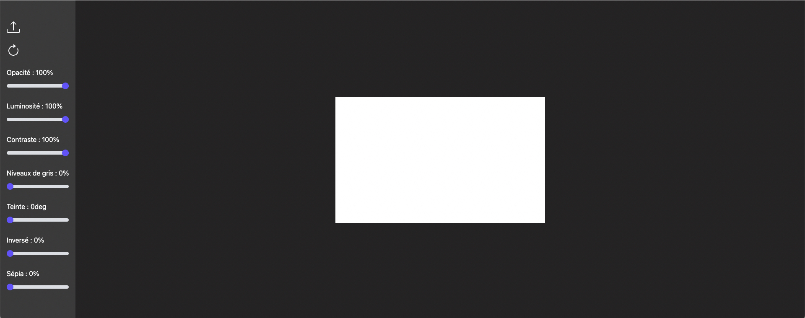
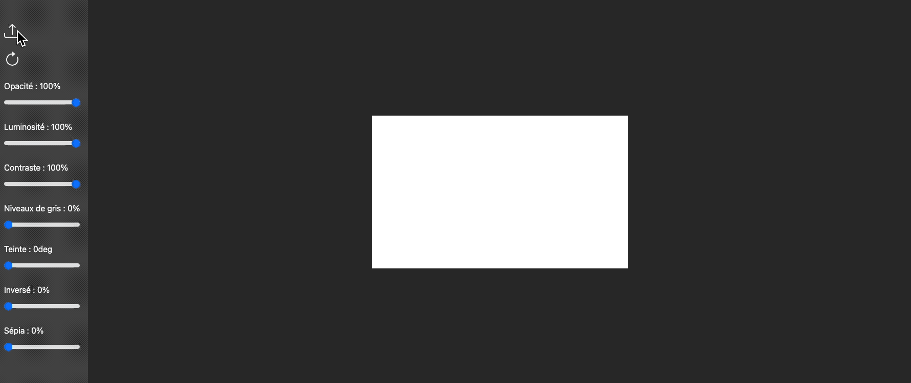
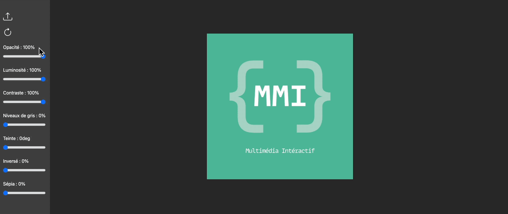

# Éditer une image avec canvas

> A JS exercise use at HEPL for MMI.

* * *

**image-editor** is an educational project, which will be used for `JS` courses.

**Note:** the school where the course is given, the [HEPL](https://hepl.be) from Liège, Belgium, is a French-speaking school. From this point, the instruction will be in French. Sorry.

* * *

Cet exercice vous donne l’occasion de manipuler les images avec canvas. Vous pouvez consulter une proposition du travail [ici](https://hepl-mmi.github.io/image-editor/).

## Énoncé

1. Commencez par rendre visible le canvas en le dessinant en blanc.
    

1. Permettez à l'utilisateur de choisir une image. Quand l'image choisie par l'utilisateur est complètement chargée, en mémoire, dessinez l'image dans le canvas. Ce dernier prend la taille de l'image.
    

1. On peut charger une image à partir du bouton de chargement ou bien en cliquant dans le canvas qui est alors encore vide. Bien entendu, une fois qu'on a choisi une image et qu'on clique une deuxième fois dans le canvas, on n'est plus invité à choisir une image. Le clic n'a alors plus d'effet.
    

1. Permettez à l'utilisateur d'appliquer une rotation de 45°. Bien sûr, on peut répéter cette opération à l'infini. Notez que la largeur et la longueur du canvas doivent être mises à jour avant chaque rotation.
    

1. Permettez à l'utilisateur d'appliquer des [filtres](https://developer.mozilla.org/en-US/docs/Web/API/CanvasRenderingContext2D/filter) sur son image. Servez-vous à bon escient des attributs : `id`,`value`,`for`,`data-unit`,`data-text`.
    

## Bonus 👏

1. Mettez en place une stratégie de zoom et de déplacement dans l’image. Si l'image est trop grande alors on la dessine à l'échelle tout en permettant de se déplacer et de zoomer librement dans l'image.
2. Permettez de sauvegarder l'image.
